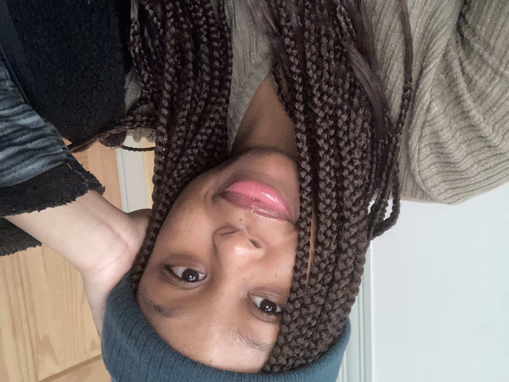

# maa724.github.io

## Self Introduction
My name is Martina Albin. Currently, I am a junior at Lehigh University studying journalism and psychology. This is my page for my data journalism class.
As a journalism major, I am very much interested in communications, media, and writing. With psychology, I am interested with the different ways psychology in how different forms and media can influence individuals. I am currently a student reporter for my university's newspaper, [Brown & White page](https://thebrownandwhite.com/author/maa724/), where I have written a couple of articles in the last year; I have wrote about various topics ranging from the college town of Bethlehem, to student life.  Additionally, for a year I worked as a freelance writer for a social media company, Tree Frog Social; I wrote about different pop culture and social media topics. This past summer, I had an internship with Sant Jordi Hostels in Barcelona where I wrote articles about traveling and exploring Barcelona for the [company's blog](https://www.santjordihostels.com/blog/).
